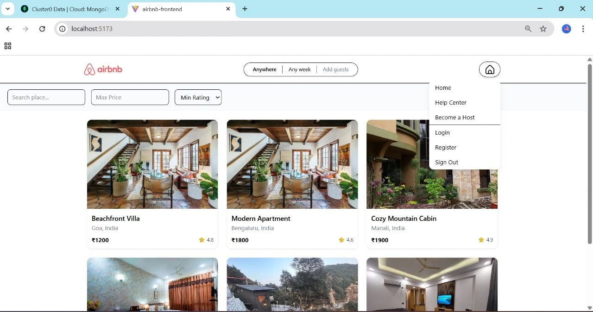
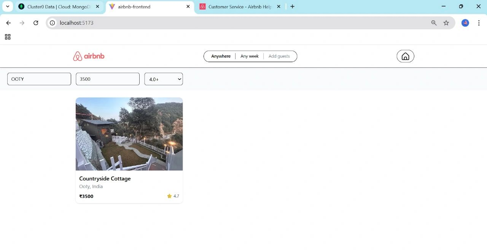
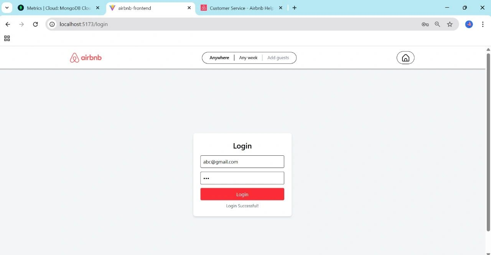
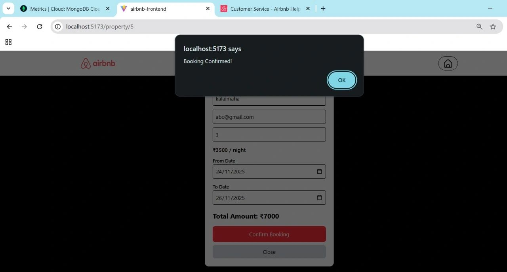

# 🏠 MERN Airbnb Clone

A full-stack Airbnb-style web application developed using the MERN stack as part of my Full Stack Development internship at SmartED Innovations.

## 📌 Project Overview

This project is a full-stack web application inspired by Airbnb. It allows users to register, log in, browse properties, view property details, and make bookings through a responsive user interface.

The application uses a React.js frontend, Node.js and Express.js backend, and MongoDB for database management.

## 🛠️ Tech Stack

### Frontend
- React.js
- React Router
- Tailwind CSS
- Axios

### Backend
- Node.js
- Express.js
- MongoDB
- JWT Authentication

### Tools
- Postman
- Git & GitHub

## ✨ Features

- 👤 User registration and login
- 🔐 JWT-based authentication
- 🚪 User logout
- 🏠 Property listing and browsing
- 🔎 Property search and filtering
- 📋 Property details
- 📅 Booking management
- 🗄️ MongoDB database integration
- 🔗 REST API integration
- 📱 Responsive user interface

## 📸 Screenshots

### 🏠 Home Page



### 🏘️ Property Listing



### 🔐 Login Page



### 📅 Booking



## 📂 Project Structure

```text
airbnb-clone/
├── airbnb-backend/
├── airbnb-frontend/
├── bookings.png
├── home.png
├── login.png
├── property_listing.png
└── README.md
